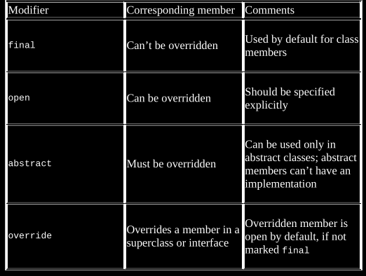
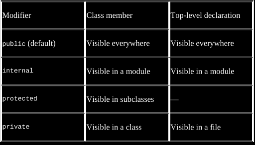

# Objects in kotlin

## Classes

The blueprint to create an object.

### Constructors

#### Order of execution

1. Primary constructor and it's properties (if it has).
2. Properties and initializers in the order define in the class body.
3. Secondary constructors.

### Access modifiers



### Visibility modifiers



All types used in the list of base types and type parameters of a class, or the 
signature of a method, has to be as visible as the class or method itself.

public, protected and private modifiers are preserved when compiling. The only 
exception is a private class: it's compiled to package-private since there is no
private classes in java.

In the case of the internal modifier, there is no direct analogue in java. So, 
it becomes public in the bytecode. The solution to this is that if you try to 
access an internal declaration from another java module the members are all mangled.

### Inner classes

A nested class with no explicit modifiers is the same as a static nested class
in java. That means that the nested class won't hold any reference to it's outter
class. To change that you have to specify it as `inner`.

To reference the outer class you use labels:
```kotlin
class Outer(){
    inner class Inner(){
        fun getOuterReference: Outer = this@Outer
    }
}
```

#### Inheritance

By default kotlin classes and class members are final. This is a design decision
made to solve the [fragile base class problem](../soft_dev/oop/classes.md#fragile-base-class).
[Smart casting](types.md#smart-casting) is another significant benefit of classes that are final.

If you override a member of a base class or interface, the overriding member will
also be open by default.

## Interfaces

In the case you implement two interfaces that share a function signature, you have
to implement your own. You can call the upper interface function using 

Kotlin compiles the interfaces to a regular interfaces and a class named `DefaultImpls`
containing the default method bodies as static methods.

Interfaces can contain properties with getters and setters as long as it don't 
hold any state.

## sealed modifier

Sealed class are abstract by default.

When you use a when expression evaluating a superclass or an interface, you would
have to use the default branch. Unless, you declare the superclass or interface 
as sealed, in wich case it will allow the creation of subclasses or the 
implementation of the interface only at compile time and in the same module. 
So you won't have to specify a default branch and in the case that you create another
class the compiler will alert you to add it to the `when` expression.

## Default methods

Like java there are some default methods that you can override for a better experience.

### toString

It works mainly for debugging. It returns the class name and the memory address 
of the instance.

### equals

It's important to compare if two objects are the same.

When using the `==` operator the `equals()` function is call.

### hashcode

It's important for using data structures that compares the hash like hashset or
hashmaps.

### Autogenerated methods

When using a data class, all the default methods above are autogenerated with the 
adition of other methods, such as:

#### copy method

To help using inmutable objects, data classes autogenerate a copy method

```kotlin
class Prueba(val name: String, val number: Int){
    fun copy(name: String = this.name, number: Int = this.number): Prueba{
        return Prueba(name, number)
    }
}
```

## Implementation delegation: the `by` keyword

When you need to implement a large interface you would have to implement many 
functions that you probably wont use or you don't care for it's behaviour. To 
solve this problem kotlin introduces the `by` keyword wich let's you delegate the
implementation to a class that already implements it.

Example: you want to implement the collection interface, wich has many functions that
you wont use. You can delegate the implementation to a class like `ArrayList`.

```kotlin
class DelegatedCollection<T>(
    innerlist: Collection<T> = ArrayList<T>()
    ): Collection<T> by innerList
```
## `object` keyword

It defines a class and creates an instance of that class at the same time.
It support the same capabilities as a normal class except that it does not have 
constructors.
Use cases:
- [Singleton](../soft_dev/design/singleton.md) 
- Companion objects: is the declaration of an object inside a class and as so 
  it can access the class private members and constructors. Good for factory patterns 
  and for declaring functions that are relevant to the class.
- Object expressions: For anonymous objects.

## inline classes

For performance and type safety.
